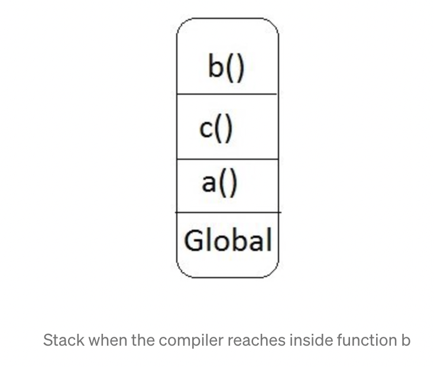

# 概述

本篇文章主要解释什么是作用域（scope），什么是执行上下文

> https://medium.com/koderlabs/javascript-scope-chain-and-execution-context-simplified-ffb54fc6ad02

# 作用域

**作用域的定义是可执行上下文能访问到的一系列的变量跟对象的集合。**

- 每个函数或者可执行的上下文都有他们自己的作用域。
- 除开自身的作用域之外还存在全局作用域

通过下面的代码来展示js是如何创建的作用域

```js
const bestAvenger = 'Iron man';
function a () {
  const bestActor = "Neymar";
  console.log(bestAvenger); // output:Iron man
  function c() {
    const bestProgrammingLanguage = 'Html';
    console.log(bestActor); // output:Neymar
    b();
  }
  c();
}
function b() {
  console.log(bestProgrammingLanguage); // not defined error
}
a();
```

Let’s assume the scope of :

- global window is called **G**
- function a is called **A**
- function b is called **B**
- function c is called C

那么作用域包含的内容如下

```json
G = { a(), b(), const bestAvenger } //全局作用域
A = { c(), const bestActor } //function a
B = { } // function b
C = { const bestProgrammingLanguage } // function c
```

> 函数的作用域依赖于它定义的位置，而不是它调用的位置

# 执行上下文

**函数代码执行的环境被称为执行上下文，每一个函数都拥有自己的执行上下文**

函数的执行上下文可以粗略的认为等价于下面的内容


- 传递给函数的参数
- 函数的作用域链（scope china）
- this的值

## 变量对象

- 变量对象(variable object) 是与执行上下文相关的 数据作用域(scope of data) 。
- 它是与上下文关联的特殊对象，用于存储被定义在上下文中的 变量(variables) 和 函数声明(function declarations) 。


## 执行上下文栈

由于每个函数都有自己的执行上下文，js使用堆栈来管理执行上下文。堆栈的顶部包含了当前正在执行的函数的上下文。最底部为全局的上下文。

所以上面的代码会产生类似于下面的上下文栈



## 什么是作用域链，它是怎么创建的

通常说函数的作用域都会基于函数定义的层级与外层的作用域建立连接，那么这样的链接就可以称之为作用域链。

js在查找变量的时候会基于当前的执行上下文中的作用域链去查找。

```js
const myNumber = '3';
(function (callback) {
  console.log(myNumber);
  const myText = 'hello';
  callback();
})(function () {
    console.log(myNumber);
    console.log(myText);
  })
//由于传入有的函数中myText未定义。因此在执行callback的时候会报错
```


https://wiki.jikexueyuan.com/project/javascript-depth-understanding/javascript-kernal.html