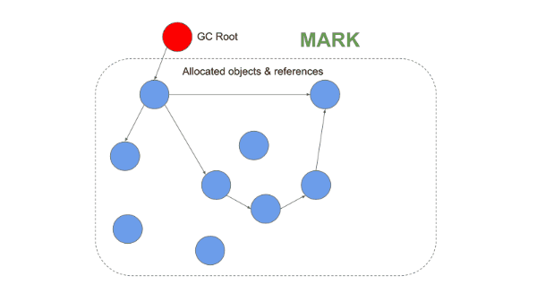

# [内存管理](https://deepu.tech/memory-management-in-v8/)

现在主流的内存管理方式可以归纳为以下几种

## 手动内存管理

语言本身不进行内存管理，开发者需要手动进行内存管理，例如 c,c++

## 垃圾回收 ♻️(GC)

垃圾回收是指自动进行内存分配以及回收操作。垃圾回收是现代语言中最常见的内存管理机制，一般以固定的时间间隔来运行该过程，垃圾回收本身会产生较小的开销，称之为暂停时间

> JVM(Java/Scala/Groovy/Kotlin), JavaScript, C#, Golang, OCaml, and Ruby are some of the languages that use Garbage collection for memory management by default.

### Mark & Sweep GC (标记&扫描内存回收)

也称之为追踪 GC，通常包含两步操作

- 首先标记使用中的内存为`alive`
- 其次清除非`alive`的内存

> 在 JVM 中，有多种不同的 GC 算法可供选择，而像 V8 这样的 JavaScript 引擎则使用 Mark＆Sweep GC 和 Reference count GC 来对其进行补充

### 引用计数

在这种方法中，每个对象都获得一个引用计数，该引用计数随对它的引用的更改而增加或减少，并且当计数变为零时将进行垃圾回收。

> 该方式并非最优选择，因为不能解决循环引用计数的问题

## 在初始化获取资源 RAII

内存跟对象的生命周期绑定到一起，在构造时申请，在析构时释放。

> 例如 C++的 class

## 自动引用计数(ARC)

跟引用计数类似，但会在编译时插入对应的`retain`和`release`指令。该方式也不能解决循环引用计数的问题，需要开发者进行规避。

# v8 内存管理

## V8 memory structure

由于 js 是单线程的，所以 v8 在每个 js 的上下文中使用一个进程，因此如果你使用了 Service Worker，v8 将为每一个 Service Worker 生成一个新的 v8 进程。

> **在 V8 进程中，始终由分配的内存来代表正在运行的程序，这称为 Resident Set。**

## 堆内存

V8 在此处存储对象或动态数据。这是最大的内存区域，这是垃圾回收（GC）发生的地方。

> 垃圾回收并不是发生在整个堆内存上，只有年轻代跟老年代由垃圾回收管理。

- 新空间（年轻代）
  新对象暂存的地方，空间很小，又被分为了两个半空间(`semi-space`),该空间由“ Scavenger（Minor GC）”管理。

  > 可以使用--min_semi_space_size（Initial）和--max_semi_space_size（Max）V8 标志来控制新空间的大小。

- 老空间(旧世代)
  在新空间存在了两次 GC 周期的对象将被移动到 old space。该空间有 主要 GC 管理

  > 可以使用--initial_old_space_size（Initial）和--max_old_space_size（Max）V8 标志来控制旧空间的大小。

  - **_旧指针空间_**：包含具有指向其他对象的指针的幸存对象。

  - **_旧数据空间_**：包含`仅包含数据`的对象（无指向其他对象的指针）。
    > 在“新空间”中存活了两个较小的 GC 周期后，字符串，装箱的数字和未装箱的双精度数组将移到此处。

- 大对象空间  
  这里是大于其他空间大小限制的对象所在的地方。每个对象都有自己的内存区域。
  > 大对象永远不会被垃圾回收器移动
- **_代码空间_**  
  即时（JIT）编译器在此处存储已编译的代码块。这是唯一具有可执行内存的空间（尽管 Codes 可以在“大对象空间”中分配，并且它们也是可执行的）。
- Cell space, property cell space, and map space:
  这些空间分别包含了 `Cells`, `PropertyCells`, 和 `Maps`,
  这些空间包含了大小相同的对象，并且对它们指向的对象有一些限制，从而简化了收集。

**_这些空间中的每一个都由一组页面组成。页面是操作系统通过 mmap 分配的连续的内存块。除较大的对象空间外，每个页面的大小均为 `1MB`。_**

## Stack

每个 v8 进程都存在一个栈，用来存储静态数据。包含方法或者函数的 frame，原始类型的数据，指向对象的指针。

> 可以使用`--stack_size` V8 标志设置堆栈内存限制

# v8 内存使用（Heap vs Stack）

- `全局范围`保存在 Stack 的 全局 frame 中
- 每一次函数调用产生的 frame-block 都被 push 到 Stack 中
- 函数 frame 中的所有局部变量，函数参数，以及返回值都被存放在 function frame block 中
- 所有的原始类型数据都被直接存放在 stack 中。（int, string 等）
- 所有的对象类型被存放在 heap 上，通过 stack 上的指针指向这些对象类型
  > 函数也是对象类型，所以函数的定义也被存放在 heap 上。
- 当前函数的调用的新新函数，将被 push 到 stack 的顶部
- 函数调用结束之后将会从 stack pop 出去
- 当主进程结束之后，将不再有 stack 的指针指向 heap 中的对象，heap 中的对象全部变成`孤儿`对象
- 除非你明确的复制一个对象，所有对于对象的引用都是基于指针的

stack 上的内存都是由系统自动管理的，通常情况下我们不需要担心 stack 上的内存管理。
与之相对的，heap 的上内存则不由系统管理，因此垃圾回收是针对 heap 上的内存进行管理。

区分堆上的指针和数据对于垃圾回收很重要，V8 为此使用“标记指针”方法-在这种方法中，它在每个单词的末尾保留一点以指示它是指针还是数据。

# v8 垃圾回收机制

当程序尝试申请大于可用空间的内存时将产生 OOM 的错误，错误的内存管理方式则会导致内存泄漏

v8 通过释放那些在 heap 不在被引用的对象的内存来达到内存释放的目的。
v8 的垃圾回收器用来回收并从用未被使用的内存

## Minor GC (Scavenger)

将 new space 分为大小相等的两个部分。分别命名为 from-space、to-space。
每次都是从 from-space 中分配内存，如果发现 from-space 中的内存不够，就会进行一次 GC
GC 的过程可以概况如下

- 遍历 from-space 中的所有对象并标记使用中的对象为 alive。
- 将 alive 的对象复制到 to-space
- 清空 from-space 中非 alive 对象
- 交换 to-space 跟 from-space 的指针
- 在 from-space 中分配新对象的内存

## Major GC（Mark-Sweep-Compact）

标记-清扫-紧凑算法

> It uses a tri-color(white-grey-black) marking system.  
> 采用三色标记系统算法
> 

- 标记：这是两种算法共有的第一步，垃圾收集器在其中标识正在使用的对象和未使用的对象。从 GC 根目录（堆栈指针）递归使用或使用的对象被标记为活动对象。从技术上讲，这是对堆的深度优先搜索，可以视为有向图

- 清除：垃圾收集器遍历堆并记下任何未标记为活动的对象的内存地址。现在，该空间在空闲列表中被标记为空闲，可用于存储其他对象

- 压缩：清扫后，如果需要，所有使用中的对象将被移动到一起。这将减少碎片并提高为新对象分配内存的性能

> 这种类型的 GC 也被称之为（世界停止-时间暂停）GC,为了避免时间暂停，v8 引入了下面的技术

- 增量 GC：GC 是在多个增量步骤中完成的，而不是一个。
- 并发标记：标记是使用多个 helper thread 并发完成的，而不会影响 js main thread。写屏障用于在跟踪 js 创建对象之前的新引用的同时 helper thread 还能进行标记操作。
- 并发清除/压缩：清除和压缩是在辅助线程中同时进行的，不影响 js main thread
- lazy sweeping - 懒清除。  
  延迟页面中垃圾的删除，直到需要内存为止。

# 其他文章

## [如何避免内存泄漏](https://juejin.cn/post/6844904016325902344#heading-8)
