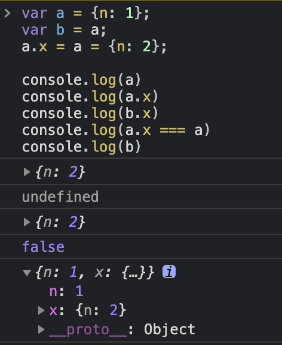

```js
var a = {n: 1};
var b = a;
a.x = a = {n: 2};

console.log(a) 	
console.log(a.x) 	
console.log(b.x)
console.log(a.x === a)
console.log(b) 	
```



js在进行赋值时是基于引用的，赋值运算符会先执行右边，再执行左边，因此

```js
a.x = a = {n:2}
//等价于
a = {n:2}
a.x = {n:2}
但是由于最新的a的引用已经变更，那么a.x实际上是操纵的b
```

# 问题2

```js
// example 1
var a={}, b='123', c=123;  
a[b]='b';
a[c]='c';  
console.log(a[b]);
//最终输入c，注意当下标为数字时，会自动转换成string

---------------------
// example 2
var a={}, b=Symbol('123'), c=Symbol('123');  
a[b]='b';
a[c]='c';  
console.log(a[b]);
//最终输出b，因为symbol是唯一的

---------------------
// example 3
var a={}, b={key:'123'}, c={key:'456'};  
a[b]='b';
a[c]='c';  
console.log(a[b]);
//最终输出c 将对象作为表达式，会调用object的toString方法
//由于b，c都没有实现toString方法，则使用默认的"[object Object]"作为key
//这道题甚至可以改成
var a={}, b={key:'123'}, c={key:'456'};  
a[b]='b';
a[c]='c';  
console.log(a[{}]);
//最终结果也是c

```

