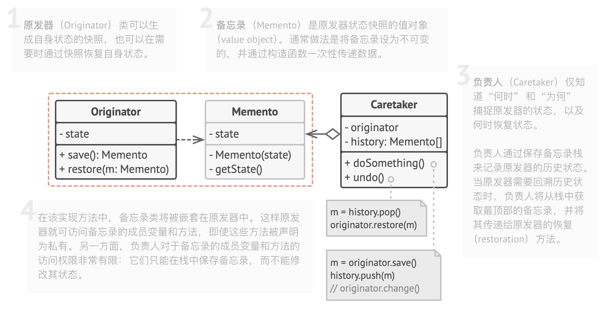

# 责任链模式

亦称： 职责链模式、命令链、CoR、Chain of Command、Chain of Responsibility

**责任链模式**是一种行为设计模式， 允许你将请求沿着处理者链进行发送。 收到请求后， 每个处理者均可对请求进行处理， 或将其传递给链上的下个处理者。

> 可以理解成数据在一系列处理器构成的链上单向流转。
>
> 类似于web事件冒泡与传递的逻辑

# 命令模式

亦称： 动作、事务、Action、Transaction、Command

 它可将请求转换为一个包含与请求相关的所有信息的独立对象。 该转换让你能根据不同的请求将方法参数化、 延迟请求执行或将其放入队列中， 且能实现可撤销操作。

- 请求可以转化成对象（生成command，command包含类型以及其他额外的参数）
- 根据不同的请求进行不同的处理：如果延迟执行，放入等待队列等
- 可以undo（可以参考后面的备忘录模式）

# 迭代器模式

亦称： Iterator

**迭代器模式**是一种行为设计模式， 让你能在不暴露集合底层表现形式 （列表、 栈和树等） 的情况下遍历集合中所有的元素。

# 中介者模式

亦称： 调解人、控制器、Intermediary、Controller、Mediator

**中介者模式**是一种行为设计模式， 能让你减少对象之间混乱无序的依赖关系。 该模式会限制对象之间的直接交互， 迫使它们通过一个中介者对象进行合作。

> 有点类似于MVC的controller，一切的逻辑都集中在controller中，所有参与者并不会直接通信，而是都与controller通信，controller在这就类似于中间人

# 备忘录模式

亦称： 快照、Snapshot、Memento

**备忘录模式**是一种行为设计模式， 允许在不暴露对象实现细节的情况下保存和恢复对象之前的状态。



- 存在一个管理state的类M，该类可以获取最新的state快照，并且可以从外部传入的state恢复
- 而调用者持有这个管理M，在进行每次操作的时候将当前的state快照放入历史记录堆栈中，在undo的时候，获取最顶层的历史记录，并通过M 恢复。

# 观察者模式

亦称： 事件订阅者、监听者、Event-Subscriber、Listener、Observer

**观察者模式**是一种行为设计模式， 允许你定义一种订阅机制， 可在对象事件发生时通知多个 “观察” 该对象的其他对象。

# 状态模式

亦称： State

**状态模式**是一种行为设计模式， 让你能在一个对象的内部状态变化时改变其行为， 使其看上去就像改变了自身所属的类一样。

状态模式建议为对象的所有可能状态新建一个类， 然后将所有状态的对应行为抽取到这些类中。

原始对象被称为*上下文* （context）， **它并不会自行实现所有行为， 而是会保存一个指向表示当前状态的状态对象的引用， 且将所有与状态相关的工作委派给该对象。**


如需将上下文转换为另外一种状态， 则需将当前活动的状态对象替换为另外一个代表新状态的对象。 采用这种方式是有前提的： 所有状态类都必须遵循同样的接口， 而且上下文必须仅通过接口与这些对象进行交互。

这个结构可能看上去与[策略](https://refactoringguru.cn/design-patterns/strategy)模式相似， 但有一个关键性的不同——在状态模式中， 特定状态知道其他所有状态的存在， 且能触发从一个状态到另一个状态的转换； 策略则几乎完全不知道其他策略的存在。

# 策略模式


- 策略模式也需要共享上下文，上下文中会包含一个指向具体策略的引用；
- 定义一个抽象的策略类，实现具体的策略子类
- 在上下文对象上设置不同的策略，然后再进行接口调用

> 本质上也是把抽象跟实现剥离开，类似于桥接模式，只不过桥接模式无法修改逻辑实现

# 模板方法模式

亦称： Template Method

**模板方法模式**是一种行为设计模式， 它在父类中定义了一个算法的框架， 允许子类在不修改结构的情况下重写算法的特定步骤。

> 实际上就是父类存在一些抽象函数定义，而这些抽象函数需要子类进行实现

# 访问者模式

**访问者模式**是一种行为设计模式， 它能将算法与其所作用的对象隔离开来。

> 在不改变原有对象实现的基础上，新增一个访问类——可以访问原来对象的数据，通过这个访问者对原有对象的功能进行扩展的模式

如果严格按照这个模式的定义其实还是会存在一个小问题，那就是我们需要先对不同的对象实例进行判断，再调用访问者对应的接口进行处理。

```js
foreach (Node node in graph)
    if (node instanceof City)
        exportVisitor.doForCity((City) node)
    if (node instanceof Industry)
        exportVisitor.doForIndustry((Industry) node)
    // ...
}
```

因此，我们还是对原来的对象做了一些小修改

```js
// 客户端代码
foreach (Node node in graph)
    node.accept(exportVisitor)

// 城市
class City is
    method accept(Visitor v) is
        v.doForCity(this)
    // ...

// 工业区
class Industry is
    method accept(Visitor v) is
        v.doForIndustry(this)

//...
```

将访问者传入具体的对象，让对象自己决定调用对应的方法。